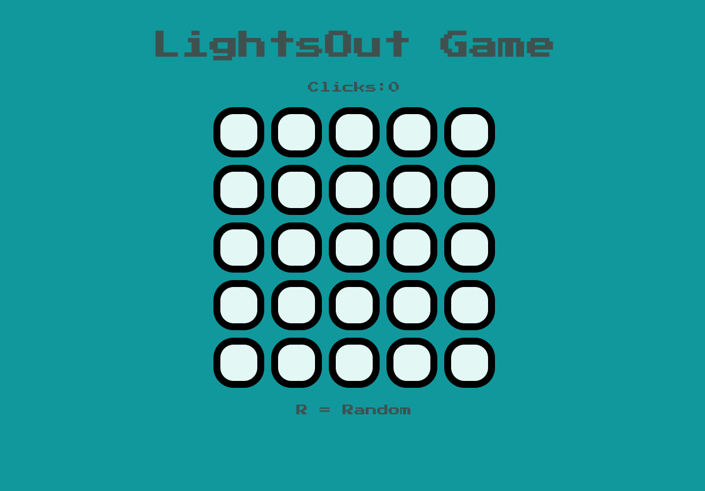
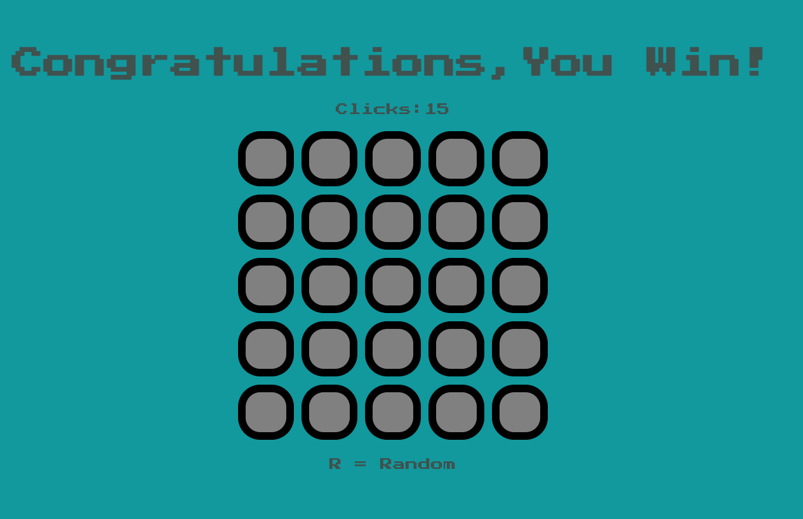

# Lights-Out-Website
> Lights out game is a game released in 1995, the goal of this game is to turn all the lights off in order to win, pressing any of the lights will toggle it and the adjacent lights

## Table of contents
* [General info](#general-info)
* [Screenshots](#screenshots)
* [Technologies](#technologies)
* [Features](#features)
* [Status](#status)

## General info
I recreated simple game of lights out using Jquery and Javascript,I created this project to practice my html,css,Javascript and Jquery knowledge

## Screenshots

## Technologies
* HTML 5 
* CSS 3
* Jquery
* JavaScript

## Features
List of features ready and TODOs for future development
* Generate random pattern
* Count the number of clicks 

## Status
Project is: _finished_
